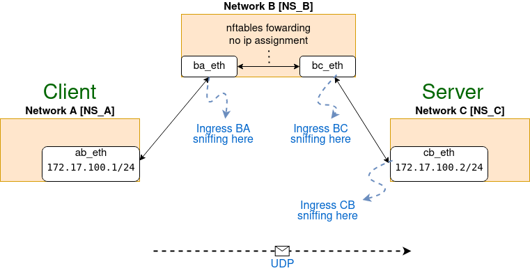

# nftables - merged-examples
This projects aims to show how counter extension for nftables works. 

## Idea

`wrapper.sh` creates 3 network namespaces (A, B & C) and 2 veth pairs
with the intention of creating a "bridge" **B** between **A** and **C**.

Then, using `with_python.sh` two forwarding rules are created with `nftables`.


```
NETWORK A       |                    NETWORK B                    |   NETWORK C
-------------------------------------------------------------------------------
ab_eth       <--|--> ba_eth <-- nftables forwarding --> bc_eth <--|--> cb_eth
172.17.100.1/24 |                no IP assignment                 |    172.17.100.2/24
```

.


## Preparation

* `git clone https://github.com/geroferrari/nftables-rules`
* `cd nftables-merged-examples`
* `python -m venv venv`
* `. venv/bin/activate`
* `pip install -r reqs.txt`
* `. venv/bin/deactivate`

## Execute

* `sudo tmuxinator start merged-examples drop_rate=10 limit_rate=125000`
* `CTRL+b d` para detach
* `sudo tmuxinator stop limit`


## Results
### 1 - No  packet drop & No Bandwit Limit:
tmuxinator start merged-examples drop_rate=0 limit_rate=125000000000

We are sending 119MBytes from the client to the server (86322 Datagrams) 
.

if we sniff in the ingress of BA_ETH we get the following results

```
Ingress    | BA_ETH                | BC_ETH                |                                                                                         
           | packets    Bytes      | packets    Bytes      |                                                                                         
ARP        | 2          56         | 2          56         |                                                                                         
ICMP       | 0          0          | 0          0          |                                                                                         
TCP        | 19         1450       | 17         1190       |
UDP        | 86323      127411304  | 1          32         |
IP         | 86342      127412754  | 18         1222       |
IP6        | 2          112        | 2          112        |
Ethernet   | 86346      127412962  | 22         1430       |
Dropped PL | 0          0          | 0          0          |
Dropped L  | 0          0          | 0          0          |
:-------------------------------------------------------------:
```

We are also getting the same result if we sniff the ingress of the server (CB_ETH)
```
Ingress    | CB_ETH                |
           | packets    Bytes      |
ARP        | 2          56         |
ICMP       | 0          0          |
TCP        | 19         1450       |
UDP        | 86323      127411304  |
IP         | 86342      127412754  |
IP6        | 2          112        |
Ethernet   | 86348      127413114  |
Dropped    | 0          0          |
:-------------------------------------------------------------:

```


We have 86323 datagrams --> It is the expected result.

But we have around 127MBytes. 
127Mbytes - 119Mbytes = 8MBytes more. 

If we take in consideration that we are sending messages at 100Mbits/sec and we transmit for 10 seconds we have the following equation:
100Mbits * 10 sec = 1000Mbits / 8 = 125MByte 

This number is much more closer to the one we have in the tables.


### 2 - 10% packet drop & No Bandwit Limit:
tmuxinator start merged-examples drop_rate=10 limit_rate=125000000000

We are sending 119MBytes from the client to the server (86322 Datagrams) 

```
[ ID] Interval           Transfer     Bitrate         Jitter    Lost/Total Datagrams                                                                 
[  5]   0.00-10.00  sec   119 MBytes   100 Mbits/sec  0.000 ms  0/86322 (0%)  sender                                                                 
[  5]   0.00-10.00  sec   107 MBytes  90.0 Mbits/sec  0.025 ms  8660/86322 (10%)  receiver
```

The server is only receiving 107 Mbytes and 8660 Datagram are lost.


if we sniff in the ingress of BA_ETH we get the following results

```
Ingress    | BA_ETH                | BC_ETH                |                                                                                         
           | packets    Bytes      | packets    Bytes      |                                                                                         
ARP        | 2          56         | 2          56         |                                                                                         
ICMP       | 0          0          | 0          0          |                                                                                         
TCP        | 19         1453       | 16         1153       |
UDP        | 86323      127411304  | 1          32         |
IP         | 86342      127412757  | 17         1185       |
IP6        | 3          184        | 3          184        |
Ethernet   | 86347      127413041  | 22         1469       |
Dropped PL | 8627       12730606   | 0          0          |
Dropped L  | 0          0          | 0          0          |
:-------------------------------------------------------------:

```
We have 86323 UDP datagrams that match with the datagrams that the client sent. And we have 8627 Dropped Datagram (Packet Loss Dropped) that match with the quantity of Datagram lost.  


We are also getting the same result if we sniff the ingress of the server (CB_ETH)
```
Ingress    | CB_ETH                |
           | packets    Bytes      |
ARP        | 2          56         |
ICMP       | 0          0          |
TCP        | 17         1347       |
UDP        | 77698      114680804  |
IP         | 77715      114682151  |
IP6        | 2          112        |
Ethernet   | 77722      114682587  |
Dropped    | 0          0          |
:-------------------------------------------------------------:
```
Here, we only have 77698 UDP Datagrams --> 86323 - 8627 = 77696
It is the expected result.


### 3 - 10% packet drop & 125000 Bandwit Limit:
tmuxinator start merged-examples drop_rate=10 limit_rate=125000

We are sending 119MBytes from the client to the server (86322 Datagrams) 

```
[ ID] Interval           Transfer     Bitrate         Jitter    Lost/Total Datagrams                                                                 
[  5]   0.00-10.00  sec   119 MBytes   100 Mbits/sec  0.000 ms  0/86321 (0%)  sender                                                                 
[  5]   0.00-10.00  sec  1.28 MBytes  1.08 Mbits/sec  0.030 ms  85289/86219 (99%)  receiver  
```

The server is only receiving 1.28 Mbytes and 85289 Datagram are lost.


if we sniff in the ingress of BA_ETH we get the following results

```
Ingress    | BA_ETH                | BC_ETH                |
           | packets    Bytes      | packets    Bytes      |
ARP        | 3          84         | 2          56         |
ICMP       | 0          0          | 0          0          |
TCP        | 19         1450       | 18         1247       |
UDP        | 86322      127409828  | 1          32         |
IP         | 86341      127411278  | 19         1279       |
IP6        | 3          184        | 2          112        |
Ethernet   | 86347      127411590  | 24         1563       |
Dropped PL | 8796       12981448   | 0          0          |
Dropped L  | 76596      113055696  | 0          0          |
:-------------------------------------------------------------:
```
We have 86322 UDP datagrams that match with the datagrams that the client sent. We also have 8796 Dropped Datagram because of Packet Loss and 76596 Dropped Datagram because of Bandwith Limit 

8796 + 76596 = 85392


We are also getting the same result if we sniff the ingress of the server (CB_ETH)
```
Ingress    | CB_ETH                |
           | packets    Bytes      |
ARP        | 2          56         |
ICMP       | 0          0          |
TCP        | 19         1450       |
UDP        | 931        1372712    |
IP         | 950        1374162    |
IP6        | 3          184        |
Ethernet   | 957        1374598    |
Dropped    | 0          0          |
:-------------------------------------------------------------:
```
Here, we only have 931 UDP Datagrams --> 86322 - 85392 = 930
It is the expected result.
